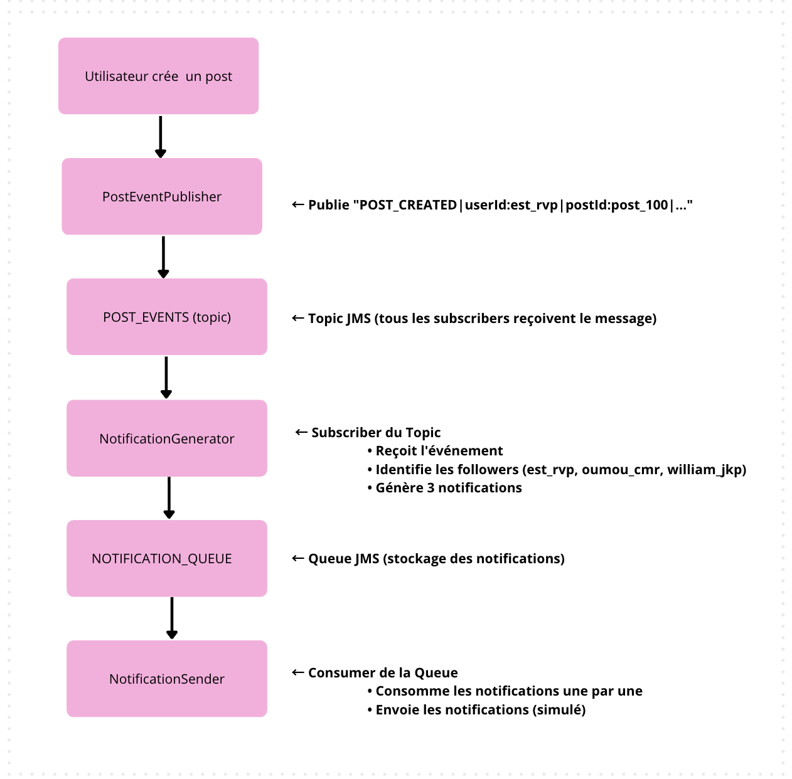
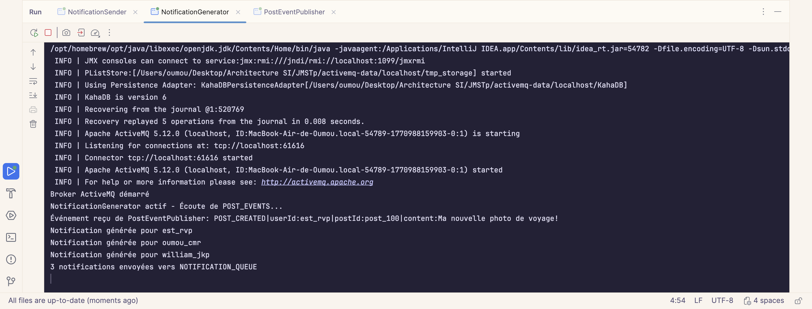
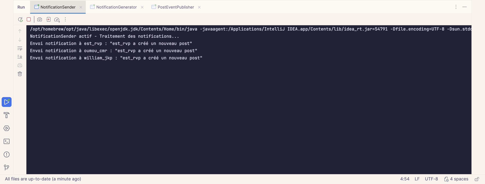
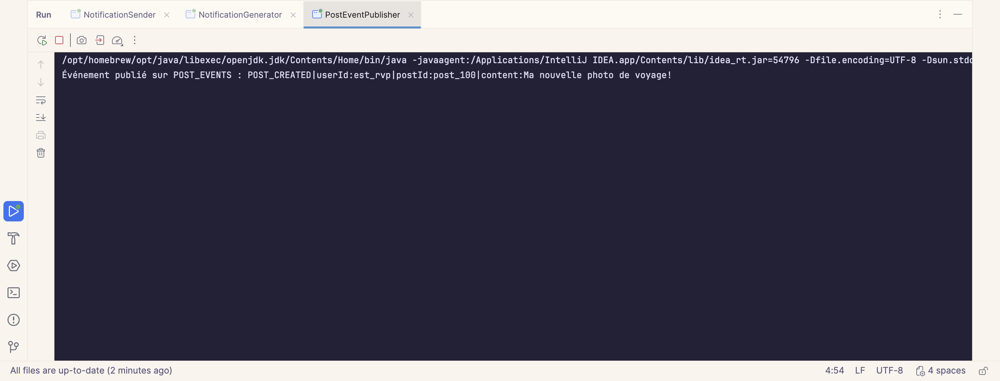
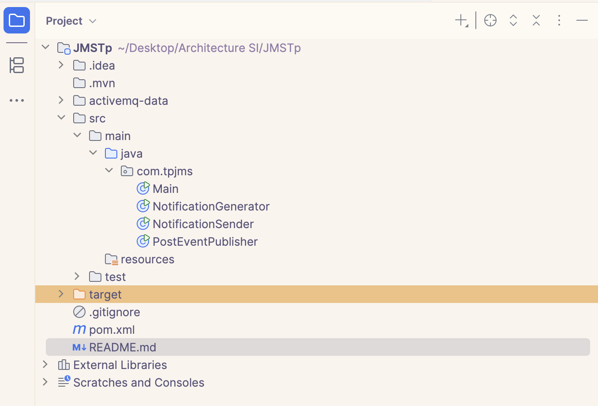

# TP JMS - Exercice 3 : Système de notifications pour réseau social

##  Description

Ce projet implémente un système de notifications asynchrone pour un réseau social, combinant les modèles **Point-to-Point (Queue)** et **Publish-Subscribe (Topic)** de JMS.

**Cas d'usage** : Quand un utilisateur publie un post sur le réseau social, tous ses followers reçoivent une notification.

---

## Architecture

### Composants JMS

| Composant | Type | Description |
|-----------|------|-------------|
| **POST_EVENTS** | Topic | Diffuse les événements liés aux posts (création, likes, commentaires) |
| **NOTIFICATION_QUEUE** | Queue | Stocke les notifications à envoyer aux utilisateurs |

### Services Java

| Service | Rôle | Type JMS utilisé |
|---------|------|------------------|
| **PostEventPublisher** | Publie les événements quand un utilisateur crée un post | Publisher (Topic) |
| **NotificationGenerator** | Écoute les événements et génère des notifications pour les followers | Subscriber (Topic) + Producer (Queue) |
| **NotificationSender** | Traite les notifications en attente et les envoie (emails, push, SMS) | Consumer (Queue) |

---

## Flux de données



---

## Exécution du projet

### Ordre d'exécution


Il faut impérativement de lancer les programmes dans l'ordre suivant car il faut que le Broker qui demarrer le serveur ActiveMQ pour que les autres programmes puissent se connecter.


#### **Étape 1 : Démarrer le Broker + NotificationGenerator**

**Fichier :** `NotificationGenerator.java`

**Dans IntelliJ IDEA :**
1. Clic droit sur `NotificationGenerator.java`
2. Sélectionner **Run 'NotificationGenerator.main()'**


**Terminal:**
```
Broker ActiveMQ démarré
NotificationGenerator actif - Écoute de POST_EVENTS...
```


- Ce programme **démarre le broker ActiveMQ** (le serveur de messages)
- Sans le broker, les autres programmes ne peuvent pas se connecter
- Il écoute aussi le Topic pour transformer les événements en notifications

*Attendez 2-3 secondes avant de passer à l'étape suivante**

---

#### **Étape 2 : Démarrer NotificationSender**

**Fichier :** `NotificationSender.java`

**Dans IntelliJ IDEA :**
1. Clic droit sur `NotificationSender.java`
2. Sélectionner **Run 'NotificationSender.main()'**


**Terminal :**
```
NotificationSender actif - Traitement des notifications...
```


- Ce programme consomme les messages de la Queue
- Il doit être actif **avant** que les messages n'arrivent dans la Queue
- Sinon, les messages s'accumulent dans la Queue sans être traités

**Attendez 1-2 secondes avant de passer à l'étape suivante**

---

#### **Étape 3 : Publier un événement avec PostEventPublisher**

**Fichier :** `PostEventPublisher.java`

**Dans IntelliJ IDEA :**
1. Clic droit sur `PostEventPublisher.java`
2. Sélectionner **Run 'PostEventPublisher.main()'**


**Terminal:**
```
Événement publié sur POST_EVENTS : POST_CREATED|userId:est_rvp|postId:post_100|...
```


- Ce programme publie juste un message et se termine
- Il a besoin que le broker soit démarré pour fonctionner
- C'est le déclencheur du flux complet

---

#### **Résultat attendu (dans les 3 fenêtres)**

**Fenêtre 1 - NotificationGenerator :**


``

**Fenêtre 2 - NotificationSender :**



**Fenêtre 3 - PostEventPublisher :**



---


### Structure du projet


---

---

### Réutilisation des exercices 1 et 2

### De l'exercice 1 (Queue) :
* `ConnectionFactory` et `ActiveMQConnectionFactory`  
`Session.AUTO_ACKNOWLEDGE`  
* Création de Queue : `session.createQueue("NOTIFICATION_QUEUE")`  
`MessageConsumer` avec `receive()`  
Pattern Producer-Consumer pour traitement asynchrone  

### De l'exercice 2 (Topic) :
Création de Topic : `session.createTopic("POST_EVENTS")`  
*  `MessageListener` avec `onMessage()`  
* `connection.setClientID()` pour identifier le client  
* Pattern Publisher-Subscriber pour diffusion d'événements  

---

## Auteur

Oumou Keirou CAMARA

## Date

Février 2025

---

## Licence

Projet académique - TP JMS
